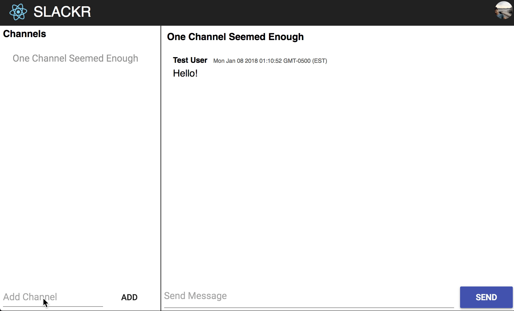

# Studio Slackr

Starter code for the studio slackr project.

# Setup

To get started fork this repo and clone your fork into a cloud nine workspace.

Then run:

    npm install

    npm start

The first command install the code this project depends on, you only need to run
this command once.

The second command serves the project locally.

Once you are able to view the slackr app go through the code to find the `TODO`s
to complete your project and add cool features.

Here's a demo of a minimal completed project:

# Expected Message Format

A message must include the following keys (properties) and values:

  - `author`: the string display name of the message author
  - `contents`: the string post
  - `timestamp`: a number representing the time of the post (use `Date.now()`)

If they do not include these properties or if you use the wrong type (e.g.
number versus string), writing to the database will return an error.

A message can include the following optional value. If you update your code to
handle these properties, you can do things cool like adding image support!

  - `image_source`: the string of an image URL (must be a valid URL, e.g.
    "http://i.imgur.com/AxV8w.jpg")
  - `is_encrypted`: a boolean (true or false) indicating whether the post is
    encrypted

# Expected Channel Format

A channel must include the following keys (properties) and values:

  - `name`: the string display name of the channel

If they do not include these properties or if you use the wrong type (e.g.
number versus string), writing to the database will return an error.

# References

Here are the relevant documentation resources for this project. Please
familiarize yourself with them so you know where to look things up!

This project uses [React](https://reactjs.org/docs/react-api.html) and 
[Firebase](https://firebase.google.com/docs/reference/js/).

The library [re-base](https://github.com/tylermcginnis/re-base#api) helps it
glue Firebase and React together.

The library [material-ui](https://material-ui-next.com/) is used for nice
looking React components. Look through the component demos to see what you can
use it for!

Finally the code behind the `npm start` command comes from
[create-react-app](https://github.com/facebookincubator/create-react-app#create-react-app-).
It also makes `npm run build` available which you will later use to publish your
slackr project.
